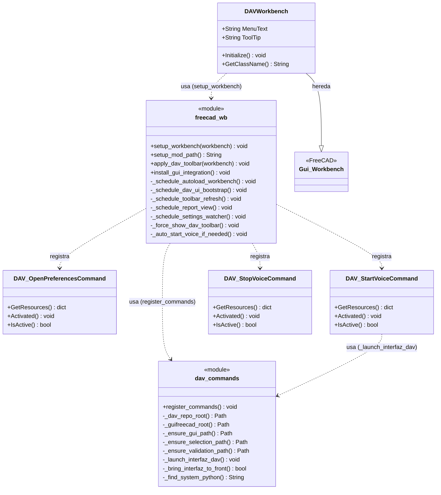
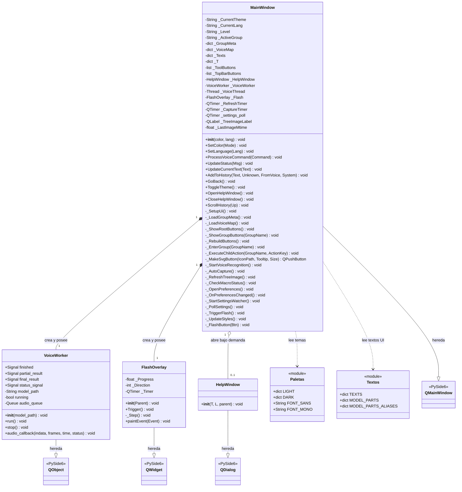
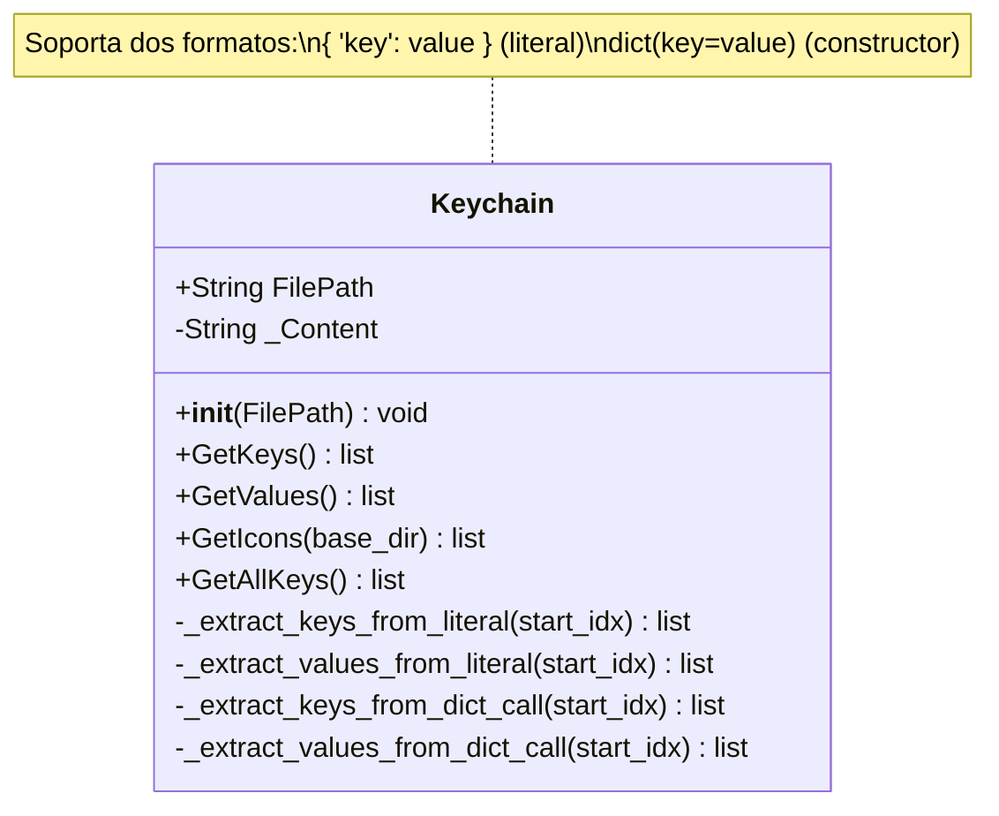
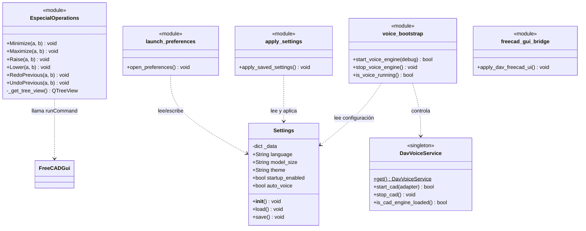
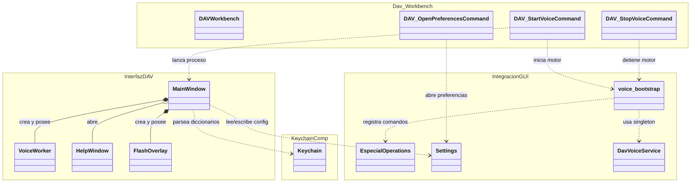

# Diagramas de Clases — Proyecto DAV

## Índice de Componentes
1. [Componente: Dav (Workbench FreeCAD)](#componente-dav)
2. [Componente: InterfazDAV (GUI de Asistente)](#componente-interfazdav)
3. [Componente: Keychain (Lector de Diccionarios)](#componente-keychain)
4. [Componente: IntegracionGUI (Puente FreeCAD)](#componente-integraciongui)
5. [Diagrama General — Relaciones entre Componentes](#diagrama-general)

---

## Componente: Dav
> **Ruta:** `ComponentesDAV/Dav/`  
> Workbench de FreeCAD que registra comandos de voz y lanza la interfaz.

---

## Componente: InterfazDAV
> **Ruta:** `ComponentesDAV/InterfazDAV/`  
> Ventana principal del asistente de voz con reconocimiento Vosk.

---

## Componente: Keychain
> **Ruta:** `ComponentesDAV/Keychain/`  
> Parsea diccionarios `.py` sin ejecutarlos para extraer claves e iconos.

---

## Componente: IntegracionGUI
> **Ruta:** `ComponentesDAV/IntegracionGUI/`  
> Puente entre el motor de voz y FreeCAD. Incluye operaciones especiales y preferencias.

---
## Diagrama General
> Relaciones entre los 4 componentes principales del proyecto DAV.

